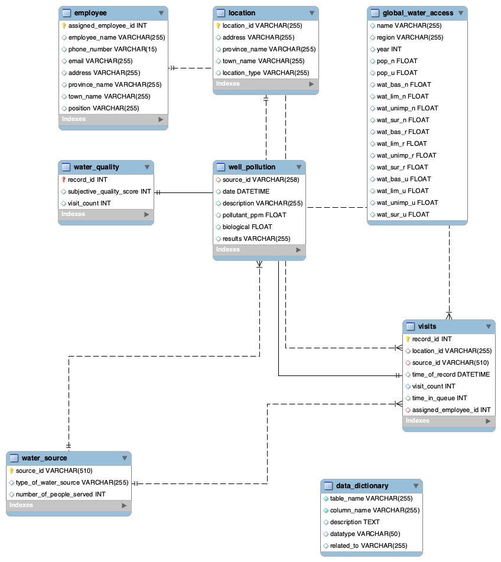

# 🧩 DATABASE SCHEMA REFERENCE  
### Project: **Water_Access_Analytics**  
**Author:** Olise Ebinum  

---

## 🗄️ Database: `md_water_services`

The **`md_water_services`** database powers the *Water Access Analytics* project — a full-scale data model for analyzing community water access, survey reliability, and infrastructure improvement.  
It integrates **geographic data, inspection visits, contamination results, global benchmarks, and progress tracking** into a unified schema for analytics and visualization (SQL → Power BI).

---

## 🧱 Core Tables and Relationships

| Table | Description | Primary Key | Key Relationships |
|--------|--------------|--------------|-------------------|
| **location** | Stores geographic details of communities (province, town, address, and location type). | `location_id` | Referenced by `visits.location_id` |
| **water_source** | Defines each water source (well, river, tap, etc.) and the number of people it serves. | `source_id` | Referenced by `visits.source_id` and `well_pollution.source_id` |
| **visits** | Logs field inspections, capturing queue time, date, and assigned employee. | `record_id` | References `location_id`, `source_id`, and `assigned_employee_id` |
| **employee** | Contains records of staff and surveyors who conduct visits and data entry. | `assigned_employee_id` | Referenced by `visits.assigned_employee_id` |
| **water_quality** | Captures surveyors’ subjective ratings for water quality during each visit. | `record_id` | Linked to `visits.record_id` |
| **well_pollution** | Contains laboratory test results identifying biological or chemical contamination. | `source_id` | Linked to `water_source` and `visits` |
| **global_water_access** | Provides global benchmark data for population and access to safe water sources. | *(None)* | Used for contextual comparisons in Power BI |
| **data_dictionary** | Metadata reference describing table columns, data types, and relationships. | *(None)* | Helps ensure schema clarity and maintainability |
| **combined_analysis_table** *(View)* | Aggregated analytical view combining location, visit, pollution, and source details. | *(Derived)* | Created from joins across multiple base tables |
| **incorrect_records** *(View)* | Highlights discrepancies between auditor and surveyor quality scores. | *(Derived)* | Built from joins between `auditor_report`, `visits`, and `water_quality` |
| **project_progress** | Tracks ongoing improvement actions (e.g., “Install UV Filter”, “Drill Well”). | `project_id` | References `water_source.source_id` |

---

## 🔗 Entity Relationships  

The schema is structured around **relational integrity** and **referential consistency**:

- **`location`** ↔ **`visits`** (One-to-Many): Each location can have multiple recorded visits.  
- **`water_source`** ↔ **`visits`** (One-to-Many): Each source can be inspected multiple times.  
- **`employee`** ↔ **`visits`** (One-to-Many): Each employee can log multiple inspections.  
- **`well_pollution`** ↔ **`water_source`** (One-to-One): Each water source can have one pollution test result.  
- **`visits`** ↔ **`water_quality`** (One-to-One): Each visit has one corresponding quality report.  
- **`global_water_access`** acts as a **reference dataset** for international benchmarking.  
- **Views** (`combined_analysis_table`, `incorrect_records`) summarize relationships for reporting.  

---

## 🧮 Analytical Flow Overview  

| Step | Process | Description | Output |
|------|----------|-------------|---------|
| **1️⃣ Data Ingestion** | Import raw tables (`location`, `visits`, `water_source`, etc.) | Builds the base schema | Clean relational structure |
| **2️⃣ Integration** | Join tables for contextual and performance analysis | Combine data into unified analytical views | `combined_analysis_table` |
| **3️⃣ Validation** | Detect inconsistencies between field and audit data | Improve data reliability | `incorrect_records` |
| **4️⃣ Aggregation** | Summarize metrics by province, town, or source type | Quantify water access coverage | Power BI datasets |
| **5️⃣ Insights & Action** | Generate project recommendations (e.g., filter installation) | Track through `project_progress` | Interactive dashboards |

---

## 🧭 Entity Relationship Diagram (ERD)

Below is the visual schema representation used in this project:

